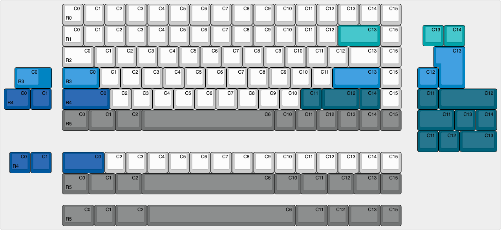

# About

This is a fork of the [ZMK-Config
repo](https://github.com/PolarityWorks/zmk-config-ckp) for the Polarity works
CKP series of keyboards.

# Compilation

Done via github action, i.e., simply commit and download the finished build
artifact.

# Advanced

If you want to exercise greater control over your CKP and have a unique layout
implemented you will need to change the matrix transform. The following diagram
displays which keys connect to which row and column pins. Note that everything
is zero indexed in the matrix transform, on the BT60V2 and BT65 the rows and
colums that aren't present lead to nowhere so dont try and change the indexing,
it's meant that way.  The matrix transform can be
found in btXX.dts where XX is the size of the board, more information on how to
do the matrix transforms can be found in the official ZMK documentation
[here](https://zmkfirmware.dev/docs/development/new-shield#optional-matrix-transform)
We're always willing to accept pull requests if you've developed your own
layouts :)
